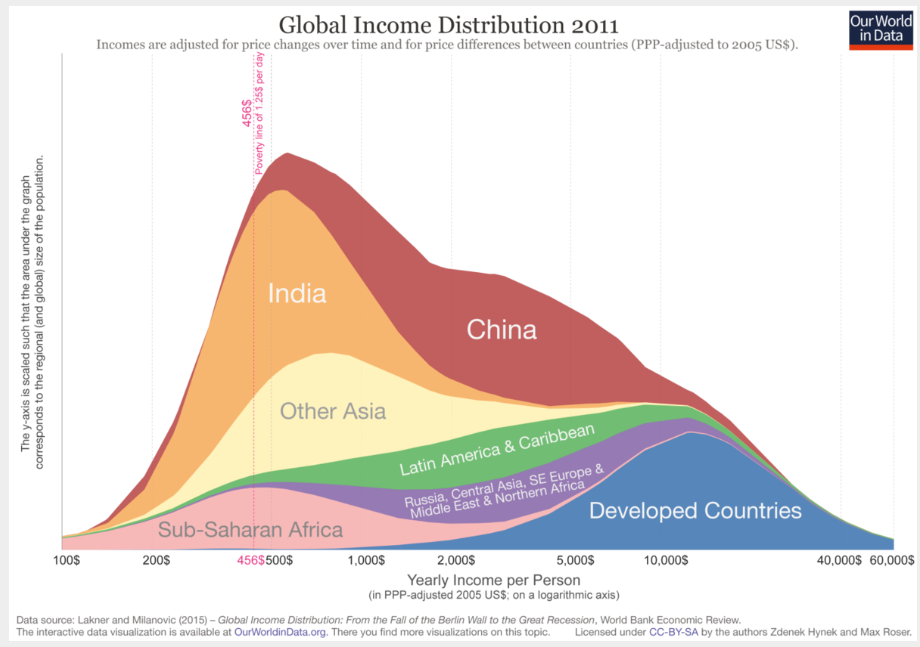

### Load packages

```{r load-packages, message = FALSE, warning=FALSE}
library(tidyverse)
library(ggplot2)
```


# Questioning data visualisations

## Image 1

```{r echo=FALSE, out.width="100%"}
knitr::include_graphics("img/Speaking-the-world.jpg")
```

_Write your comments about image 1 below_


## Image 2

```{r echo=FALSE, out.width="100%"}
knitr::include_graphics("img/rose-pop-density-total-area-bw.jpg")
```

_Write your comments about image 2 below_


## Image 3

```{r echo=FALSE, out.width="100%"}
knitr::include_graphics("img/life-expectancy-rule-of-law.png")
```

_Write your comments about image 3 below_


## Image 4

```{r echo=FALSE, out.width="100%"}

```

_Write your comments about image 4 below_


# Exercises

```{r load-data-staff, message=FALSE, eval=TRUE}
staff <- read_csv("data/instructional-staff.csv")

str(staff)
glimpse(staff)
```


## Exercise 1

What is the difference between *wide format* data and *long format* data?


Is the format `staff` data *wide* or *long*?


How many observations are there in the data set?


## Exercise 2

```{r pivoting}
## Uncomment and complete the following code

staff_long <- staff %>%
  pivot_longer(
    cols = c("1975", "1989", "1993", "1995", "1999", "2001", 
             "2003", "2005", "2007", "2009", "2011"),
    names_to = "year",
    values_to = "percent"
  )
glimpse(staff_long)
unique(staff_long$faculty_type)
```


## Exercise 3

```{r dot-plot}
# Write your code for Exercise 3 here

ggplot(data = staff_long,
       mapping = aes(x = year, 
                     y = percent, 
                     colour = faculty_type)) +
  geom_point()

```

## Exercise 4

```{r bad-line-plot}
# Write your code for Exercise 4 here

ggplot(data = staff_long,
       mapping = aes(x = year, 
                     y = percent, 
                     colour = faculty_type)) +
  geom_line()

```

## Exercise 5

```{r mutate-year}
## Uncomment and complete the following code

staff_long <- staff_long %>%
  mutate(year = as.numeric(year))
```


```{r working-line-plot}
# Write your code for Exercise 5 here
ggplot(data = staff_long,
       mapping = aes(x = year, 
                     y = percent, 
                     colour = faculty_type)) +
  geom_line()


```

## Exercise 6

```{r better-line-plot}
# Write your code for Exercise 6 here

ggplot(data = staff_long,
       mapping = aes(x = year, 
                     y = percent, 
                     colour = faculty_type)) +
  geom_line() +
  labs(title = "Percentage of Staff Over Time by Faculty Type (1975-2011)",
              x = "Year",
              y = "Percentage of Staff",
              color = "Faculty")


```

## Exercise 7

_Write below your ideas for adapting the line plot_

* Idea 1 Change title to emphasise PT
* Idea 2 PT different colour from rest, which should all be one colour
* Idea 3 PT line made bolder
* ...


## Exercise 8

```{r implement-Ex7}
# Write your code for Exercise 8 here
ggplot(data = staff_long,
       mapping = aes(x = year, 
                     y = percent, 
                     colour = faculty_type)) +
  geom_line() +
  labs(title = "Growth of Part-time Over Time compared to other Faculty Types (1975-2011)",
              x = "Year",
              y = "Percentage of Staff",
              color = "Faculty") +
  scale_color_manual(
    values = c(
      "Part-Time Faculty" = "red",
      "Full-Time Tenured Faculty" = "gray70",
      "Full-Time Tenure-Track Faculty" = "gray70",
      "Full-Time Non-Tenure-Track Faculty" = "gray70",
      "Graduate Student Employees" = "gray70"
    ))
#Title was changed to highlight the objective, the colour of pt faculty was changed to a vivid red while the others all changed to grey to emphasise the objective. This is opposed to the original vague title and different colours representing each faculty.
```

